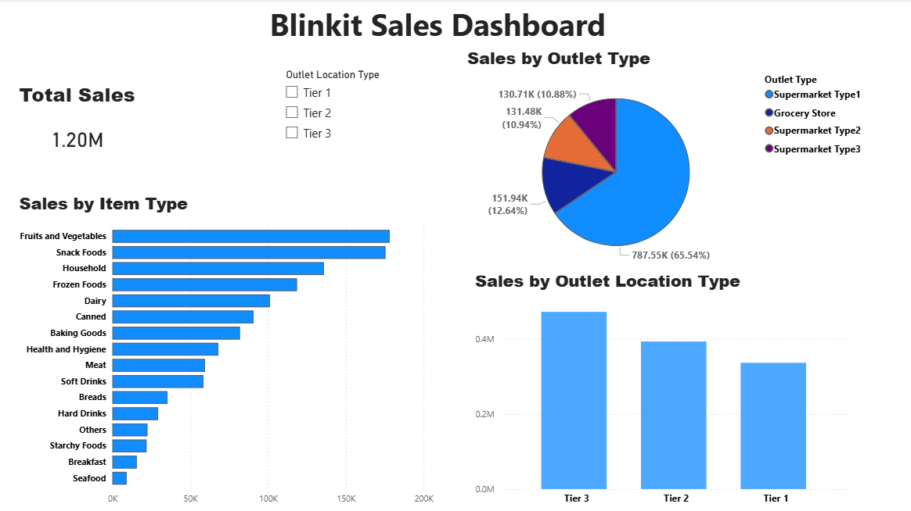

# Blinkit Sales Analysis Dashboard

## 📊 Project Overview
This project analyzes Blinkit grocery sales data using SQL and visualizes insights using Power BI.

## 🔧 Tools Used
- SQL (MySQL)
- Power BI

## 📈 Key Insights
- Fruits & Vegetables generate the highest sales revenue
- Tier 3 outlets contribute the most revenue
- Supermarket Type1 dominates overall sales

## 📁 Files
- BlinkIT-Grocery-Data.csv → Dataset
- blinkit_sales_analysis.sql → SQL queries
- Blinkit_Sales_Dashboard.pbix → Power BI dashboard
- Dashboard.png → Dashboard preview

## 🚀 Features
- Interactive dashboard
- KPI card for total sales
- Category-wise and outlet-wise analysis
- Slicer for dynamic filtering 
